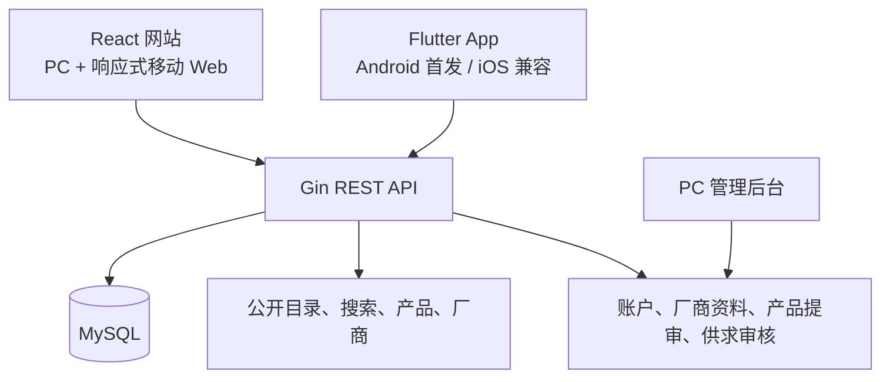
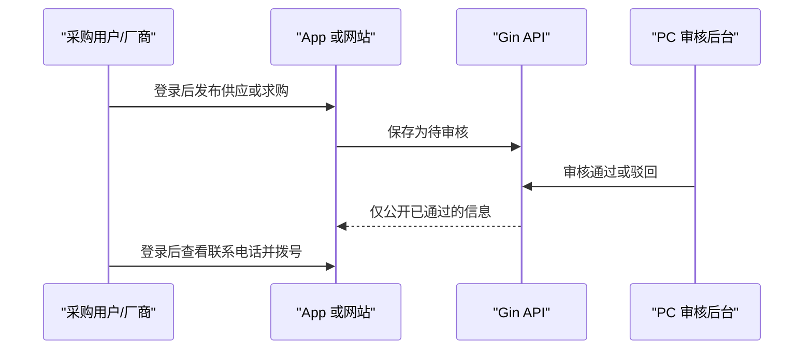

# 大陆农机配件移动端建设对标分析报告

> 调研日期：2026-08-07
> 范围：仅分析与建议；本文不代表已创建 Flutter 工程、已修改接口，或已上线任何移动端功能。

## 1. 结论摘要

建议采用“两类移动入口、同一业务后端”的路线：

- **React 网站**继续承担 PC 与移动浏览器访问，不另起一套移动 Web；在现有响应式基础上补齐供求信息等业务页。
- **Flutter App**作为 Android 优先的原生客户端，工程与 iOS 保持兼容；它通过 REST API 访问同一 Gin + MySQL 业务数据，不直连数据库。
- **首期定位为行业目录与撮合平台，不是交易商城**。采购用户可搜索、浏览、发布经审核的供求信息并查看联系方式；厂商可维护资料与产品；平台审核、配置和风控继续留在 PC 后台。

这条路线能复用已有公开目录、产品、厂商、搜索、厂商 CMS 和审核机制，同时避免在首期引入站内聊天、在线支付、短信服务或 App 端运营后台所带来的安全与运营成本。

## 2. 当前项目基线

### 2.1 已具备能力

| 范畴 | 现状 | 证据 |
| --- | --- | --- |
| 后端 | Gin + GORM + MySQL，公开 REST API 与 CMS API 已分组 | `backend/internal/api/router.go` |
| 公开目录 | 首页、厂商、产品、加工服务、搜索及筛选接口已具备 | `RegisterPublicRoutesWithAuth` |
| 移动网页 | 移动顶部菜单、侧滑导航、分类快捷入口、固定底部导航、移动搜索与筛选已实现 | `frontend/src/components/public/`、`frontend/src/styles/mobile-public.css` |
| 内容详情 | 厂商/产品详情在移动断点下已转为单列，并提供固定联系方式/产品操作区 | `mobile-public.css` |
| 厂商中心 | 厂商角色已有“我的厂商资料”“我的产品资料”和提审流程 | `/api/admin/vendor-profile`、`/api/admin/vendor-products` |
| 审核与权限 | CMS 已有管理员、编辑、审核员、厂商角色和受保护路由 | `registerAdminRoutesWithServices` |

### 2.2 尚未具备的能力

| 能力 | 现状判断 | 移动端建设含义 |
| --- | --- | --- |
| 供求信息 | `/purchase` 当前为静态内容页；未发现供求数据模型、发布、审核或公开列表 API | 需作为独立业务域规划，不能将静态页视为已实现功能 |
| 采购用户身份 | 当前账户体系围绕 CMS 用户与厂商角色；采购用户的注册、资料和发布权限尚未定义 | 需扩展统一账户角色与注册流程 |
| App 会话 | 网页写操作使用 Cookie + CSRF；尚无面向原生客户端的 access/refresh token 合约 | Flutter 不应照搬浏览器 Cookie 会话，需要专用令牌会话 |
| 移动推送/离线 | 未发现 PWA manifest、Service Worker 或 Flutter 推送实现 | 首期不纳入；后续以业务验证结果决定 |

## 3. GitHub 对标项目

调研选择遵循“功能可参考、架构可参考、许可证可判断”的原则。以下项目均为参考资料，不直接复制代码、品牌资产或商业规则。

| 项目 | 业务覆盖与移动交互 | 技术架构 | 可借鉴经验 | 局限与适配成本 | 许可证与使用建议 |
| --- | --- | --- | --- | --- | --- |
| [Bagisto Open Source eCommerce Mobile App](https://github.com/bagisto/opensource-ecommerce-mobile-app) | 首页、搜索、品类、收藏、订单、评价、深色模式与推送；Android/iOS 均有运行目标 | Flutter，依赖 Bagisto GraphQL API 与商店密钥 | 首页→搜索→品类→详情→账户的移动导航；统一 API 地址、主题和启动页的环境化配置 | 面向零售下单、购物车和优惠券，不能直接套用到“询盘/目录”业务；后端协议与本项目 Gin REST 不兼容 | [MIT](https://raw.githubusercontent.com/bagisto/opensource-ecommerce-mobile-app/main/LICENSE)。可参考或复用符合许可的通用代码，但需保留版权与许可声明 |
| [Flutter Samples](https://github.com/flutter/samples) | 路由、表单、测试、Android/iOS 适配及组件示例 | 官方维护的独立示例集合，含 `navigation_and_routing`、`platform_design`、`testing_app` 等 | 使用声明式路由、将平台差异限制在界面层、为表单与关键路径建立自动化测试 | 不是完整商城或厂商平台，不能提供业务模型、权限或审核流程 | 根许可含多类组件许可文本，且不同示例可能附带不同资源；仅按文件级许可复用并保留全部 notice，优先借鉴模式而非复制 |
| [Mercur](https://github.com/mercurjs/mercur) | B2B/B2C 多厂商平台，区分运营后台、厂商面板和顾客入口 | API-first、模块化 marketplace；React/Vite 面板、Node/PostgreSQL/Redis 基座 | 将“平台运营”“厂商维护”“采购浏览”拆成独立权限边界；厂商产品归属、审核和目录治理不应混在客户端 | 完整 marketplace 覆盖佣金、支付、库存等，本项目首期无须引入 Medusa、Redis、订单或结算 | [MIT](https://github.com/mercurjs/mercur/blob/main/LICENSE)。可借鉴角色和模块边界，不替换现有 Gin + MySQL |
| [Saleor Storefront（Paper）](https://github.com/saleor/storefront) | 产品列表/详情、移动端抽屉、账户与多步骤移动优先结算；重视弱网与可访问性 | Next.js、React、TypeScript、GraphQL、服务端缓存 | 将长流程拆成单焦点步骤；URL 驱动页面状态；对加载、重试、焦点管理和无障碍进行产品级处理 | 交易结算和多币种复杂度远高于本项目；Next.js/GraphQL 与当前 Vite/REST 不匹配 | [FSL-1.1-ALv2](https://raw.githubusercontent.com/saleor/storefront/main/LICENSE)，对竞争性用途有限制；仅作为体验和工程实践参考，不移植其代码 |

### 对标结论

1. **移动体验**：采用 Bagisto 的“高频浏览入口 + 搜索 + 分类 + 我的”结构，但不复制购物车/结算信息架构。
2. **工程结构**：采用 Flutter Samples 的特性分包、路由守卫、表单测试与双平台适配思路。
3. **角色边界**：采用 Mercur 的三端职责划分，防止将平台管理权限下放到厂商或采购端。
4. **交互质量**：采用 Saleor 的移动优先、短流程、弱网重试和可访问性原则；不引入其技术栈或受限制代码。

## 4. 推荐目标架构

### 4.1 技术边界

- **保留**：Gin、GORM、MySQL、React、TypeScript、Vite、现有 REST API 与 PC CMS。
- **新增建议**：独立 Flutter 客户端，使用 `Dio` 访问 API、`go_router` 管理导航、`Riverpod` 管理状态、系统安全存储保存令牌。
- **不建议**：为了 App 将当前后端整体替换为 Saleor、Medusa、Bagisto 或 Mercur；这些项目的基础设施和业务模型均超出当前目标。
- **会话建议**：网页继续使用 Cookie + CSRF；原生 App 新增 Bearer access token + refresh token。令牌应可撤销、可过期、仅存入 Android Keystore/iOS Keychain，绝不写入普通偏好设置或日志。

### 4.2 建议信息架构

App 首期底部导航建议为：

1. **首页**：搜索、热门分类、优质厂商、推荐产品/服务与供求入口。
2. **分类搜索**：配件分类、筛选、关键词搜索、产品与厂商结果。
3. **供求**：求购/供应信息流、筛选、详情、登录后发布、我的发布。
4. **厂商**：厂商目录、厂商详情、主营产品与“查看联系方式”。
5. **我的**：采购用户资料与发布记录；厂商登录后额外显示厂商资料、产品维护、提审状态和数据概览。

网页继续使用当前顶部导航、移动菜单、分类宫格和底部导航；供求页面应同时提供 PC 列表布局与移动单列卡片布局。

## 5. 角色、账号与供求闭环建议

### 5.1 角色边界

| 角色 | 允许操作 | 不允许操作 |
| --- | --- | --- |
| 匿名访客 | 浏览已公开的产品、厂商与供求；使用搜索筛选 | 查看受保护联系方式、发布内容、维护厂商资料 |
| 采购用户 | 自助账号密码注册；发布/编辑自己的供求；查看已发布联系方式 | 审核任何内容；维护其他用户或厂商资料 |
| 厂商 | 采购用户全部浏览能力；维护已绑定厂商资料与产品并提交审核 | 审核内容；查看/修改其他厂商的私有资料 |
| 平台管理员/审核员 | 审核供求、厂商与产品内容；处理账号、风险与运营配置 | 不应通过 App 执行高风险批量配置或账号治理 |

统一账户体系可由同一个用户主体承载多个角色：采购用户自助注册后获得 `buyer` 权限；运营人员在后台为通过核验的账户绑定厂商及 `vendor` 权限。这样用户无需维护两套身份，厂商在 App 或网页登录后可自然进入厂商中心。

### 5.2 供求信息闭环

建议字段：信息类型（供应/求购）、标题、配件分类、适配机型、地区、数量/交期说明、正文、联系人、联系电话、发布者、审核状态、驳回原因、发布时间和截止时间。联系电话应在登录后才返回，并记录查看行为；页面不应通过 HTML、日志或接口错误信息泄露联系方式。

首期不包含：站内即时聊天、在线支付、订单、报价单协同、短信验证码、推送通知、地图定位及 App 端运营审核。

## 6. 需要改造的接口与数据清单（建议，不实施）

| 范畴 | 建议内容 |
| --- | --- |
| App 认证 | `POST /api/app/auth/login`、`POST /api/app/auth/refresh`、`POST /api/app/auth/logout`；返回短期 access token、可撤销 refresh token 和角色摘要 |
| 账户 | 扩展用户角色以支持 `buyer`；采购用户使用账号密码自助注册；厂商绑定仍由运营后台控制 |
| 供求公开 API | 公开列表、详情、筛选；仅返回审核通过且未过期内容；联系方式通过独立、已登录的读取接口获取 |
| 供求用户 API | 发布、编辑、撤回、查看“我的发布”，仅可操作自身记录 |
| 供求审核 API | 管理员/审核员查看待审、通过、驳回和下架；保留审核人、时间和原因 |
| 既有 API | 继续消费厂商、产品、搜索、筛选、厂商资料和产品维护接口；通过版本化 DTO/契约测试保证 React 与 Flutter 一致 |

## 7. 分期建议与验收口径

| 阶段 | 目标 | 交付判断 |
| --- | --- | --- |
| 0：契约与原型 | 完成接口契约、角色矩阵、移动页面原型和隐私文案 | 确认字段、权限、状态与异常策略后再编码 |
| 1：目录浏览 | Flutter 登录、首页、分类、搜索、产品/厂商详情；React 补齐同一内容入口 | 同一公开数据在网页和 App 展示一致，弱网可重试 |
| 2：厂商中心 | 厂商资料、产品维护、提交审核和状态展示 | 厂商只能看到并编辑自己绑定的数据 |
| 3：供求闭环 | 发布、审核、公开列表、登录后查看电话 | 未审核内容不可见；越权操作被拒绝；电话不在公开响应中 |
| 4：上架准备 | Android 真机验证、崩溃监控、隐私政策、iOS 构建验证 | Android 可稳定安装；iOS 工程可构建但不承诺同步上架 |

## 8. 风险与控制措施

| 风险 | 控制措施 |
| --- | --- |
| 虚假供求与垃圾发布 | 审核后公开、频率限制、内容敏感词/人工复核、可撤回和封禁记录 |
| 电话号码滥用 | 登录后读取、记录访问、按账号/IP 限速、隐私告知与投诉入口 |
| App 与网页权限不一致 | 以 API 服务端权限为唯一事实来源；客户端只做展示级隐藏，不承担授权判断 |
| Token 泄露或长期有效 | 短 access token、刷新令牌轮换与撤销、设备安全存储、HTTPS、日志脱敏 |
| 过早引入交易复杂度 | 首期明确不做支付、订单、聊天、结算；以供求发布量、联系转化和审核时效决定后续投入 |
| 开源许可误用 | 实施前逐文件检查许可证、第三方依赖和品牌资产；Saleor 仅借鉴思路，不复制代码 |

## 9. 最终建议

优先把现有“公开厂商目录”延展为“可审核的供求撮合平台”，而不是将其改造成完整电商交易系统。短期以 React 移动网页继续承接搜索引擎和分享访问，以 Android Flutter App 提升登录用户、厂商维护和高频浏览体验；中长期再依据真实供求撮合数据决定是否投入推送、报价协同、站内消息或交易能力。
